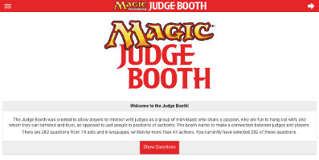
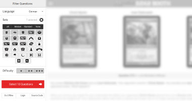
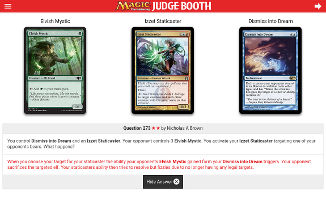
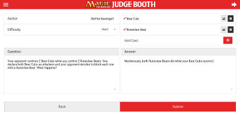
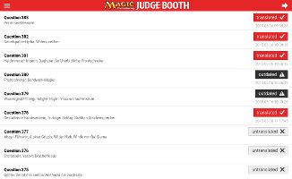
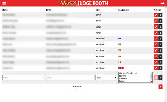

Interactive JudgeBooth
======================

This project provides a digital web-based version of the popular "Judge Booth" at bigger Magic: The Gathering(TM) events.

The booth wants to make a connection between judges and players by providing a diverse set of rules questions
and testing the player's knowledge in a fun environment. The questions are available in 3 levels of difficulty and more
than 5 different languages.

It is available online under [booth.magicjudges.org](http://booth.magicjudges.org) to everyone and supports all internet-ready devices
and screen sizes. If you discover a bug, please [open a ticket](https://github.com/bra1n/judgebooth/issues)!

Usage
-----

Using the Judge Booth should be pretty self-explanatory. Once the website has loaded, you'll find a short introduction
and a button that lets you start with questions right away on the home screen. If you want to customize your experience,
there is a menu available on the left side of the booth. You can either open it by clicking on the left icon in the
title bar, or by swiping the screen from left to right.

### Sidebar options

In the sidebar menu you'll finde several options to customize the list of questions.

* You can select from one of the available languages
  (English, German, French, Russian, Traditional Chinese, Simplified Chinese)
* You can choose from which expansions the questions should be selected. If you only want to see Standard or Modern
  legal cards, there is a quick filter for both available at the top of the expansion list.
* Finally, you can choose which difficulty levels to include in your list of questions. 1 star is "easy", 2 is "medium"
  and 3 is "hard".

After you made your choices, the big button below the filters will tell you how many questions fit your criterias.
If there is at least 1 question available, you can click the "Select"-button and select these questions to use in the
booth.

### Questions

Once you're on the question page, you'll see a number of cards that are relevant for this question. If you want to see
the oracle text for any of the cards, just click on the card image and it will flip to the "oracle text" side.

**Note:** Some foreign cards don't have images available, yet. You will see the back of the card in this case. To show
the (English) Oracle text, just click on the card back.

Below the cards you will find the question number, the difficulty level (number of stars) and, if known, the author of
the question, next to the question text itself. Show this question to the player and once they are sure of their answer,
click on the "Show Answer" button to show the answer. Alternatively, you can also use the up/down arrow keys on your keyboard to show and hide the answer.

To go to the next question, click on the right arrow in the title bar, swipe the screen to the left or press the right
arrow key on your keyboard. To go to the previous question, click the "Back" button in your browser or press the left arrow key on your
keyboard.

**Note:** If you need to increase (or decrease) the size of the booth, just use your browser shortcuts, usually `CTRL + Plus`
or `Command + Plus`. (Minus for zooming out) The booth app has been built to scale seamlessly for bigger / smaller displays.

### Offline mode

In case you don't have an internet connection where you want to set up the booth, there is an Offline Mode available.
To use it, you have to click on *Go Offline* in the sidebar menu while you still have internet. You will then be taken
to a slightly different URL, which you should bookmark for later when you're offline. After a couple of seconds, the
necessary files will be downloaded and disconnecting your internet should leave you with a still-usable booth, minus the
card images.

Administration
--------------

The Judge Booth comes with a powerful backend that allows you to quickly submit new questions, edit existing ones or
create new translations. In order to authenticate you, it utilizes the Google API similar to how Google Docs works and
requires that you have an email address associated with Google to use when logging in.

In order to log in, an *admin* role user needs to give you access to the backend first. After that is done, just click
on the `Login` button in the sidebar, log in to your Google account and authorize the Judge Booth app to verify your email
address.

**Note:** The Judge Booth doesn't store any data from your Google account at all, it only uses the Google API to retrieve
your email address and compare it to the list of authorized users.

Once you're logged in, you'll find a second *admin menu* in the sidebar, which can be accessed through the tabs at the bottom.
There you will find a number of additional menu points, depending on the role that has been assigned to you. The currently
supported roles are:

- **[Guest](#guest-add-new-questions)**: Is allowed to submit new questions
- **[Translator](#translator-add-and-update-translations)**: Is allowed to add and change translations for questions in their predefined language(s)
- **[Editor](#editor-verify-edit-and-delete-questions)**: Is allowed to edit, delete and publish questions
- **[Admin](#admin-add-edit-and-delete-users)**: Is allowed to add, edit and delete users

*Each role includes all rights of the roles above it.*

### Guest: Add New Questions

New questions can be added to the system easily. Each newly added question will be *disabled* at first and needs to be
manually approved by an *Editor* or *Admin* user. Once the question is set `live`, it will be visible on the booth. The
author field is prefilled with your own name - if you are an *Editor* or *Admin* user, you can also submit questions on
behalf of other people and change the value of this field.

To add a new question, first select the *Difficulty* of the question, choosing between Easy, Medium or Hard. At the
moment, most of the questions in the database are classified as *Medium*, so we're always in need of new Easy or Hard
questions.

Second, select the card or cards that your question uses. Make sure that you don't select **more than 5** cards, in order
to keep the question simple enough and reduce the space that the cards take up. Split cards and Double-Faced cards need to
be added with each half / side separately. If you use the same card more than once, you should still add it only once to
the list. If you need to use tokens, just enter the name of the token. Once the gray `X` turns into a colored checkmark,
your card has been accepted by the system and can be used in the question. The order of the cards can be changed with
the up and down arrow next to the card name.

Finally, enter the question and answer text in the appropriate boxes. Try not to turn the question into a "yes/no" question,
which would allow the players to guess the answer. Use *you* and *your opponent* when describing the board situation and
avoid unnecessary information like the number of lands each player has, unless they are relevant to the question. If you
mention any of the cards you entered earlier by *full name*, they will be highlighted on the question page later.

Once you're happy with your question, hit the *Submit* button and wait for the confirmation popup.

### Translator: Add and Update Translations

The translation interface shows you at a quick glance what the current translation status for each question is. Each entry
has the question number, followed by the list of localized card names (where available). On the right hand side, you'll
find a big button colored and labeled differently, depending on the current status. Below that button there will be a
timestamp to indicate when the last change was made to this question's translation.

To quickly navigate the translation list, you can use the *search* box in the top left corner. Just enter any question number,
card name or translation status (*translated*, *untranslated*, *outdated*) to filter the list. It is also possible to negate
your search term by prepending it with an exclamation mark: `!untranslated` would show only translated (and not outdated)
entries. If you have access to more than one translation language, you can switch the current language in the top right
corner.

Questions that are *grayed out* are disabled and currently not live. Translating the live questions is more important, but
once these are done, you can take a look at the newest non-live ones, since those will probably be set to live at
some point in the future.

To translate a question just click on it and fill in the question / answer text boxes on the new screen. If you need to
look up a specific card text, just click on the card name in the list on the right side there. Sometimes the card will not
have an image, unfortunately this is a problem with Gatherer and you'll have to look these up yourself.

### Editor: Verify, Edit and Delete Questions

As an editor, it is your job to take care of the questions that get submitted by the other judges, fix any logical and
textual mistakes in the English questions and keep an eye on the translation status for each language. Since the English
question and answer texts are the basis for all translations, it is important that errors are caught before they get
copied into a dozen different languages. Because of this, editors also have access to each translation and can also toggle
the *live* status of each question.

On the overview list, you will see an entry for each individual question that has been submitted to the system, ordered
from newest to oldest. Each question will show you its number, the cards that are used in the question, the author (where
available) and the "live" status. Toggling a question live / offline can be done directly on this page with a single click.
Below that, you will see a list of all available languages, each one highlighted in a different color depending on the
status of the question in that language. *Gray* means it's currently untranslated, *red* means it's translated and up-to-date,
*black* means it's translated but outdated.

You'll find a link to the live question (if it is live) next to the languages, followed by an icon to *Edit* and *Delete*
the question. Editing a question looks almost exactly like adding a question, the only difference is that you can change
the live status and can see when the question has been changed last. On the overview list you will only see the first 20
questions, if you need to go to a different page, just click on the left / right buttons. You can also manually select a
specific page by clicking on the page number.

**Note:** Updating an English question causes all available translations to be flagged as *Outdated*, even if you don't
end up changing anything important. So keep in mind to only edit an existing question if you have to, or update the translations
yourself if you only make a minor edit!

### Admin: Add, Edit and Delete Users

Administrators are able to manage the users that have access to the backend through the list on this screen.
For each user you will see (and can edit) their *full name*, email address, *role* and assigned *languages*, if they are a
translator. To edit a user, click on the *pen* icon, to delete them click on the *trash can*. Adding a new user is done
by clicking on the *plus* icon at the bottom of the list.

The user name is used when that user submits a new question, so make sure to avoid any spelling mistakes here. For the email
address, you need to enter the same one that they use on Google, since this email address will be used to authenticate them
when they log in. Finally, you have to select a role for that user and, if they are a *translator*, one or more languages
for the translation interface. Any other role except *translator* should not have languages assigned to them.

**Note:** Users are identified by their (case-insensitive) email address, which needs to be unique. This means that you can't
assign the same user to multiple roles and is the reason why each role includes the rights of all roles "below" it. A translator
can do everything a guest can, an editor can do everything a translator can and an admin can do everything an editor can.

Development
-----------

If you want to contribute to the source code, feel free to fork the project and run your own version.

To get started, you need PHP (with Curl support) and a MySQL database with the structure and data from `backend/judgebooth.sql.gz`.

If you are familiar with Docker, just run `docker-compose up -d`. You have to adjust the database host configuration in `backend/config.php` with `judgebooth-mysql` and then go to [localhost:8080](http://localhost:8080).

You can update the existing booth data via backend/import.php script from the command line. Example command: `php import.php sets`
You should update the data in this order: sets, cards, tokens, translations
With this data, there should already be a single question in several different languages in your own booth visible.

The set icon list and the "Modern" / "Standard" filters depend on the content of the `sets` database table. Each set
 there has a flag for `modern`, `standard` and `regular`. These flags need to be manually set in the database and will
 affect which set icons are listed at all (`regular = 1`), listed as a Standard set (`standard = 1`) and listed as a
 Modern set. (`modern = 1`)

When the database is ready, you need to install the Gulp Node modules (`npm install`) and the Bower dependencies.
(`bower install`) This allows you to build the application files via running `gulp` or `gulp watch`.
Once everything has been built and the database is ready, point your local webserver to the project root folder. If
you're using something other than Apache, make sure to set up a similar path rewrite like the one provided in the
`.htaccess`.

**Running the project from a subfolder**

If you want to serve the project from a subfolder (example: `localhost/booth/`), you need to update the `<base>` tag in
the `index.html` to reflect the current path, for example: `<base href="/booth/">`

**Using the admin interface**

In order to be able to use the admin interface, you need to generate OAuth 2.0 credentials for the Google APIs.
This process is outlined [here](https://developers.google.com/identity/protocols/OAuth2). Make sure that the redirect URL points to your online project URL. Once you have your redirect URL, ClientID and ClientSecret, enter these values into your `backend/config.php` file.
After that, you only need to add a user to the `user` table with a Google Mail account and the role `admin`. `user.languages` can be left empty for admins.

License and Copyright
---------------------

Card images are all copyright Wizards of the Coast.

Card database is provided by [mtgjson.com](http://mtgjson.com) under public domain license.

This website is not affiliated with Wizards of the Coast in any way.
